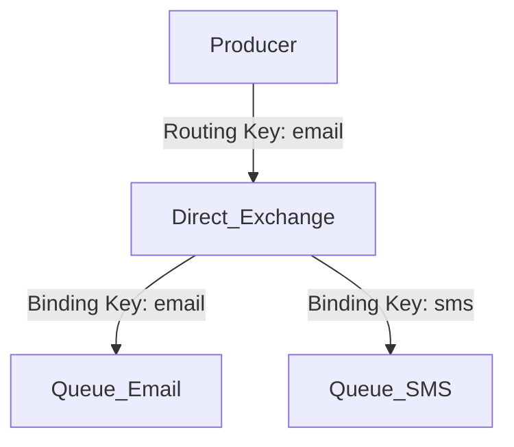
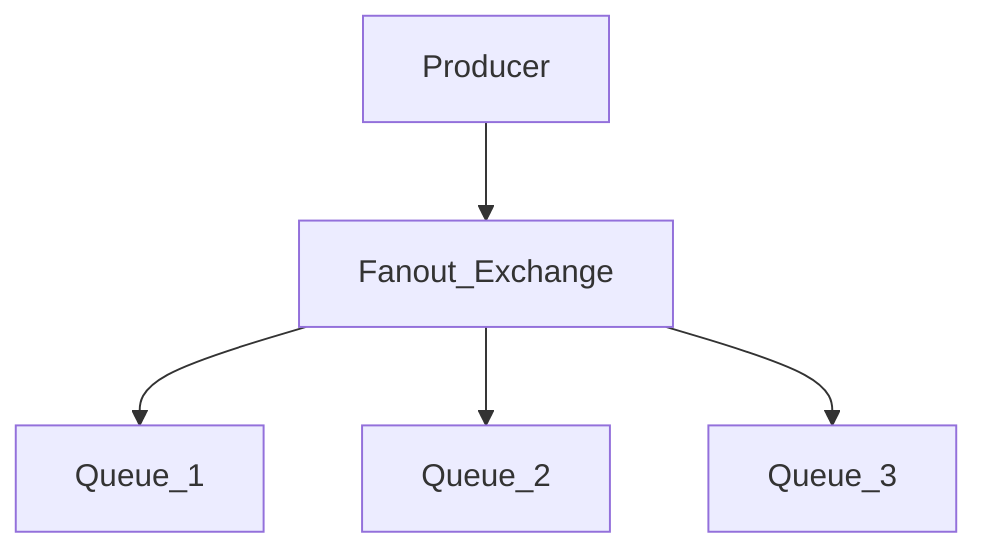
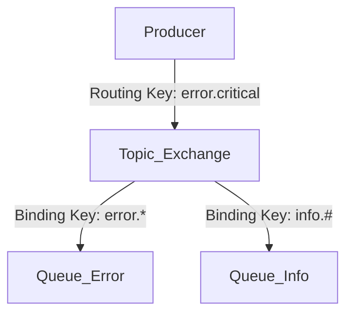
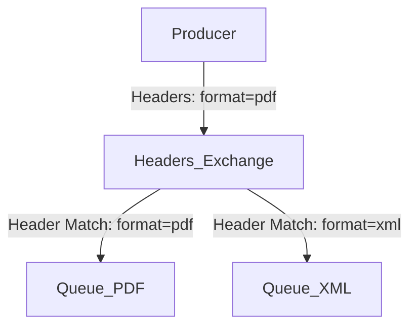
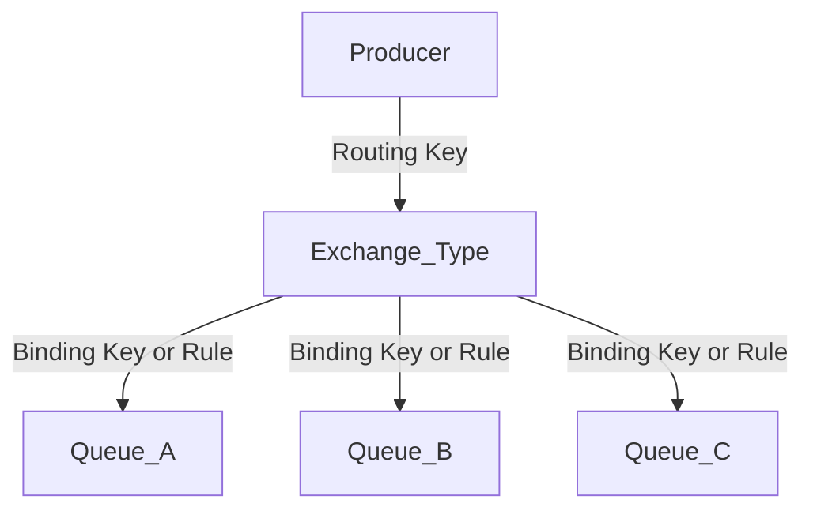

# Tipos de Exchanges no RabbitMQ

### 1. Direct Exchange

* Descrição:
  * A exchange roteia mensagens para as queues que têm uma binding key exatamente igual à routing key da mensagem.
* Exemplo de Cenário:
  * Aplicação de envio de notificações onde diferentes tipos de mensagens (como "email" ou "sms") são roteadas para filas específicas.
* Características:
  * Alta precisão no roteamento.
  * Útil para sistemas onde cada mensagem tem um destinatário específico.
  
# 

### 2. Fanout Exchange
* Descrição:
  * A exchange ignora a routing key e entrega a mensagem para todas as queues vinculadas.
* Exemplo de Cenário:
  * Sistema de publicação de eventos, como notificações de novas postagens ou atualizações, onde todas as partes interessadas precisam receber a mensagem.
* Características:
  * Roteamento sem filtros.
  * Útil para sistemas de broadcast.
 
# 

### 3. Topic Exchange

* Descrição:
  * A exchange roteia mensagens com base em padrões na routing key. Suporta caracteres especiais como:
  * `*` (um único nível no caminho).
  * `#` (zero ou mais níveis no caminho).
* Exemplo de Cenário:
  * Sistema de logs, onde as mensagens são roteadas com base em categorias como "error.*", "info.#", etc.
* Características:
  * Flexibilidade no roteamento.
  * Útil para sistemas complexos com várias regras de roteamento.

#

### 4. Headers Exchange
* Descrição:
  * A exchange roteia mensagens com base nos cabeçalhos (headers) da mensagem em vez de usar a routing key.
* Exemplo de Cenário:
  * Aplicações onde o roteamento depende de informações específicas como "formato de arquivo" ou "prioridade".
* Características:
  * Muito flexível, mas mais pesado em termos de desempenho.
  * Útil para sistemas que dependem de metadados detalhados.

#

### Resumo dos Cenários
<table>
  <thead>
    <tr align="left">
      <th>Tipo de Exchange</th>
      <th>Cenário Ideal</th>
    </tr>
  </thead>
  <tbody align="left">
    <tr>
      <td>Direct</td>
      <td>Mensagens direcionadas com base em routing keys exatas.</td>
    </tr>
    <tr>
      <td>Fanout</td>
      <td>Mensagens para todas as filas vinculadas (broadcast).</td>
    </tr>
    <tr>
      <td>Topic</td>
      <td>Mensagens filtradas com base em padrões complexos.</td>  
    </tr>
    <tr>
      <td>Headers</td>
      <td>Mensagens filtradas com base em cabeçalhos específicos, ignorando a routing key.</td>    
    </tr>
  </tbody>
</table>

# 

